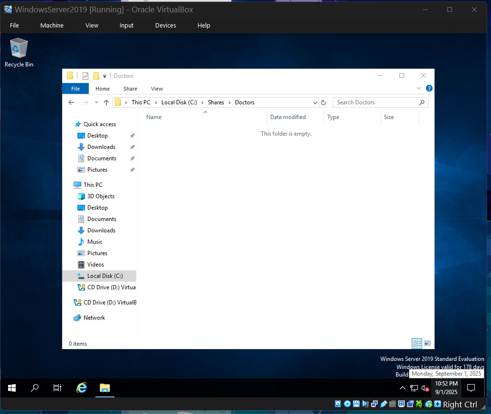

# Active Directory RBAC Demo Lab

This lab simulates an Active Directory domain in a Windows Server VM.  
It demonstrates **user provisioning, OU structure, security groups, and role-based access control (RBAC)** with full evidence via screenshots and PowerShell automation.  

---

## 🛠️ Tools & Environment
- Windows Server 2019 (Desktop Experience) in VirtualBox  
- Active Directory Domain Services (AD DS)  
- PowerShell automation (`New-BulkADUsers.ps1`, `users.csv`)  
- NTFS + SMB shares for role-based access control  

---

## 🚀 Steps & Evidence

### 1. VM Setup & Roles
Configured Windows Server in VirtualBox and added the AD DS role.  
  
  

---

### 2. Domain Controller Promotion
Promoted the server to Domain Controller for `uhlab.local`.  
  

---

### 3. Organizational Units & Groups
Created `Healthcare_Staff` OU with sub-OUs for Doctors, Nurses, and IT.  
Provisioned security groups for each department.  
  
  

---

### 4. Bulk User Provisioning
Created test users (Dr. Alice, Nurse Ben, IT Sam) via PowerShell CSV import.  
  
  
  

---

### 5. Role-Based Access Control (RBAC)
Applied NTFS Modify rights per group to dedicated folders.  
- Doctors → `C:\Shares\Doctors`  
- Nurses → `C:\Shares\Nurses`  
- IT → `C:\Shares\IT`  

  
  
  
  

---

### 6. Access Testing
Confirmed access works only for proper groups.  
- Dr. Alice → Doctors ✅, Nurses ❌  
- Nurse Ben → Nurses ✅, Doctors ❌  
- IT Sam → IT ✅  

  
  
  
  
  

---

### 7. Final Sanity Check
Verified shares and group membership via PowerShell.  
  

---

## 📌 Reflection
- Learned how to provision AD DS, OUs, groups, and users both via GUI and PowerShell.  
- Solved a **real-world NTFS ownership issue** using `takeown`, `icacls`, and `Set-Acl`.  
- Built repeatable automation with PowerShell for bulk provisioning.  
- Discovered that by default, **users cannot log on locally to DCs**. Wrote a PowerShell script to adjust `SeInteractiveLogonRight` for lab-only testing.  
- **Real-world note**: In production, users log on to domain-joined clients or member servers — never directly to DCs.  

---

## 📂 Repo Contents
- `users.csv` — test user list  
- `New-BulkADUsers.ps1` — bulk provisioning script  
- `Fix-LocalLogon.ps1` — lab-only script to allow test user login to DC  
- `evidence/` — screenshots documenting the lab  

